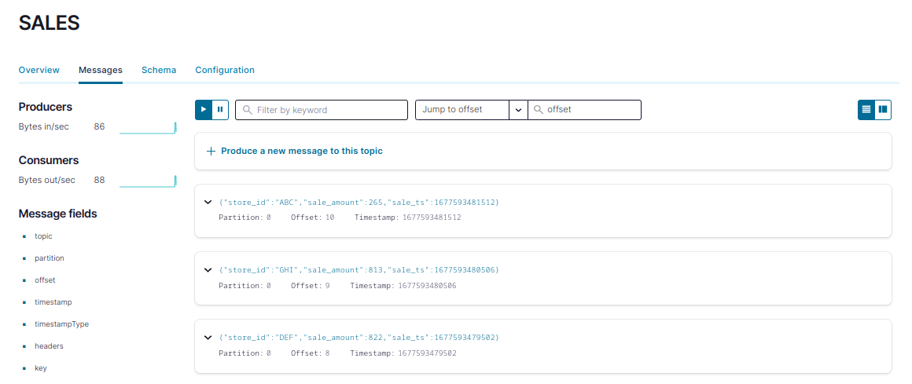
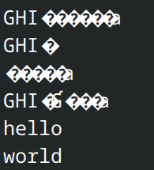

## :computer: Requirements

The project was developed using `openjdk 11.0.18` and built with `Apache Maven 3.8.7`.

To check your version of Java and Maven, type the following commands; with the output for my configuration below.

```bash
## Check Java version
($)> java --version
openjdk 11.0.18 2023-01-17
OpenJDK Runtime Environment (build 11.0.18+10)
OpenJDK 64-Bit Server VM (build 11.0.18+10, mixed mode)

## Check Maven version
($)> mvn --version
Apache Maven 3.8.7 (b89d5959fcde851dcb1c8946a785a163f14e1e29)
Maven home: /opt/maven
Java version: 11.0.18, vendor: Oracle Corporation, runtime: /usr/lib/jvm/java-11-openjdk
Default locale: en_US, platform encoding: UTF-8
OS name: "linux", version: "6.1.12-arch1-1", arch: "amd64", family: "unix"
```

If you do not have these configs, or if you do not have/do not want to install Java and Maven; I also built a Docker image for this small Java application. Make sure to have [Docker installed](https://docs.docker.com/get-docker/). My Docker config is

```bash
## Check Docker version
($)> docker --version
Docker version 23.0.1, build a5ee5b1dfc
```

The application's image can be pulled from my [dockerhub repo](https://hub.docker.com/u/theodorecurtil).


## :building_construction: Build the Project

### Clone the Repository

The first step is to clone this repository. `cd` into the folder where you want to host this project's repo and type the command

```console
## Clone repo
git clone git@github.com:theodorecurtil/kafka_sales_producer.git

## cd into the repo
cd ./kafka_sales_producer
```

If you want to play around with the Kafka producer, you can do so and build the application's jar-file using the following command within the `./kafka_sales_producer` folder.

```console
mvn clean compile assembly:single
```

:whale: You can also use the provided [Dockerfile](https://github.com/theodorecurtil/kafka_sales_producer/blob/main/Dockerfile) to build your own Docker image running your producer. To build your local image, run the following command from within the `./kafka_sales_producer` folder.

```console
docker build -t <image-name> .
```

## :factory: The Infrastructure

This repo only contains the Java application that publishes messages to an existing Kafka cluster. This means that this code won't run except it can pusblish messages to an existing Kafka cluster. In order to get this application to run, we need to start a Kafka cluster and related services...

:tada: The good thing is that this was the subject of my previous [blog post](https://acosom.com/)! To get a running local Kafka infrastructure is easy: simply refer to my [github repo](https://github.com/theodorecurtil/kafka_101) that accompanies the blog post.

To get the cluster up and running do the following

```console
## Clone repo
git clone git@github.com:theodorecurtil/kafka_101.git

## Docker compose up
cd ./kafka_101 && docker-compose up -d
```

You should see 4 services running on the Docker network `kafka_101_default`:

1. control-center
2. schema-registry
3. broker
4. zookeeper

Now that the infrastructure is running, we can start the Kafka producer!

## :running: Run the Application

One can run the application directly in the CLI using the `java` command, or in a Docker container (which I recommend as a good practice).

### In the CLI

You can run the producer locally using the java CLI. The `App.java` main method takes some command line arguments for the adress of the Kafka server, and of the schema registry. Because yes, in this repo we are also going to play around with [Confluent's schema registry](https://docs.confluent.io/platform/current/schema-registry/index.html#sr-overview). For a video intro about the schema registry, and why you should use the schema registry in th first place; refer to [this video](https://developer.confluent.io/learn-kafka/schema-registry/key-concepts/).

Assuming you started the Kafka cluster using the proposed method, the Kafka broker should be running on `localhost:9092`, and the schema registry on `localhost:8081`. If you picked a different port mapping, update the value for ports and type the command below to start producing events:

```console
java -Dkafka.server.ip=http://localhost:9092 -Dschema.registry.ip=http://localhost:8081 -jar target/kafka_producer-1.0-SNAPSHOT-jar-with-dependencies.jar
```

### In a Docker Container

Alternatively, you can also run the application inside a Docker container. If you run the producer in a Docker container, the Kafka and schema registry services are not local to the producer anymore. So you have to connect the producer to the network where those containers are running, and address them using their containers names. Again, if you followed the proposed approach to get the infra running, the Kafka broker will be running on `http://broker:29092`, and the schema registry on `http://schema-registry:8081`; and all these containers should be running on the `kafka_101_default` network.

To check that this is indeed the case, check that the network does exist:

```console
docker network ls
```

To check that the broker and the schema registry are indeed connected to this network, type

```console
docker network inspect kafka_101_default
```

Get the producer producing, by running the command

```console
docker run --name my_producer --network <kafka-infra-network> -e KAFKASERVER=http://<kafka-server-container-name>:29092 -e SCHEMAREGISTRY=http://<schema-registry-container-name>:8081  theodorecurtil/kafka_sales_producer:latest
```

## :stethoscope: Sanity Checks

By default, the producer should be producing messages in the auto-created `SALES` topic at a frequency of 1 msg/s. To check that messages are indeed being produced; go to the Confluent control center UI on [localhost:9021](http://localhost:9021/clusters) and navigate to the Topics tab. Click on the `SALES` topic and then on the `Messages` tab. You should see messages reaching the cluster there.

You should see something like the below:



## :rocket: One Step Further

To go one step further, we will leverage the schema registry to enforce [schema validation](https://docs.confluent.io/platform/current/schema-registry/schema-validation.html#sv-on-cs). When running the Java application, as the `SALES` topic was originally not registered, it was auto-created when publishing to it. And by default at topic creation, schema validation is not enabled; even though the producer did register the schema in the schema registry.

To see that the schema was indeed registered, navigate to the `Schema` tab of the `SALES` topic in the UI. Or type the following in your browser:

```console
http://localhost:8081/subjects/SALES-value/versions/latest
```

But the fact that schema validation is not enabled means that the producer application could start producing "contaminated" messages not fitting the schema, and get away with it. To try that out, we will manually add some messages to the topic using Confluent CLI, simply sending strings without keys.

```console
## Enter the container
docker exec -it broker bash

## Publish messages to the broker
kafka-console-producer --bootstrap-server localhost:9092 --topic SALES
>hello
>world
```

Then consume those messages from the CLI.

```console
kafka-console-consumer --bootstrap-server localhost:9092 --topic SALES --from-beginning
```

You will see something like below



And because messages are serialized using Avro, they display as weird characters in the terminal. But you see that the two messages `hello` and `world` were added to the topic. This is not a good behavior as this data does not fit the schema and might disrupt consumption on consumers side.

To circumvent this, let us enforce schema validation. This is done at the topic level, at topic creation. Let us delete the `SALES` topic and recreate it using:

```console
## Enter the container
docker exec -it broker bash

## Delete the topic
kafka-topics --bootstrap-server localhost:9092 --delete --topic SALES

## Recreate the topic with schema validation
kafka-topics --create --bootstrap-server localhost:9092 --replication-factor 1 \
--partitions 1 --topic SALES \
--config confluent.value.schema.validation=true

## Produce the contaminated records
kafka-console-producer --bootstrap-server localhost:9092 --topic SALES
>hello
>[2023-02-28 14:47:51,851] ERROR Error when sending message to topic SALES with key: null, value: 5 bytes with error: (org.apache.kafka.clients.producer.internals.ErrorLoggingCallback)
org.apache.kafka.common.InvalidRecordException: Log record DefaultRecord(offset=0, timestamp=1677595670815, key=0 bytes, value=5 bytes) is rejected by the record interceptor io.confluent.kafka.schemaregistry.validator.RecordSchemaValidator
```

As you can see, sending messages that do not fit the schema will throw `org.apache.kafka.common.InvalidRecordException`. This ensures that contaminated records will not propagate to the consumers, and ultimately to the downstream applications.

You can start producing normally again using the producer which will send messages fitting the schema! Et voilà! :tada:

## :next_track_button: What is Coming Next?

This repo will be published as a blog post on [Acosom website](https://acosom.com/). In the following post (and repo), we will be using the introduced infra and concepts to get started with [Apache Flink](https://flink.apache.org/). We will use this fictitious sales data producer to create a streaming analytics pipeline with Flink using the multiple APIs. Now the cool things start :chipmunk:! You can follow my posts and be notified when the blog posts release by following me on [Twitter](https://twitter.com/theodore_curtil) :baby_chick: